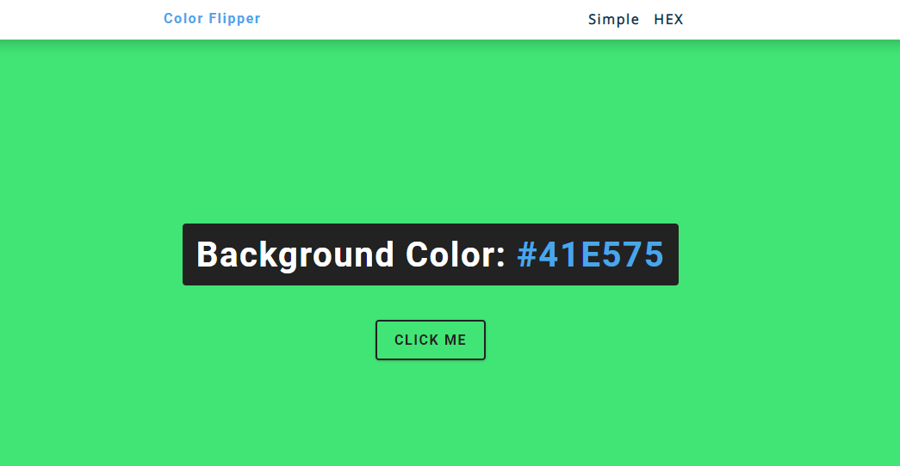
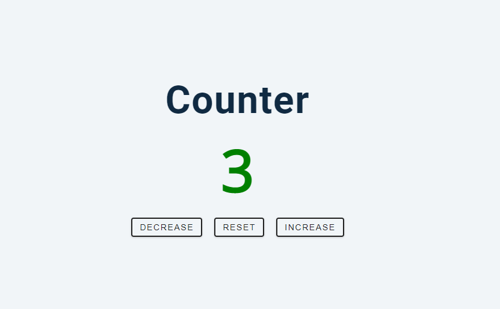
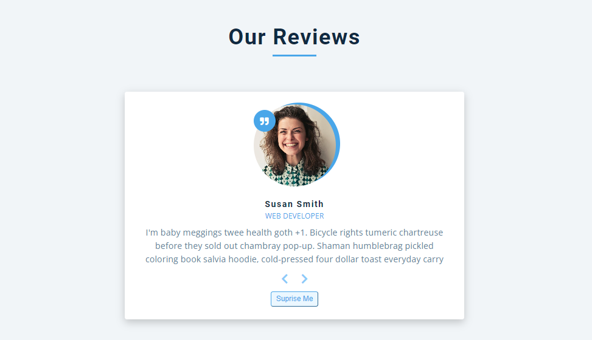
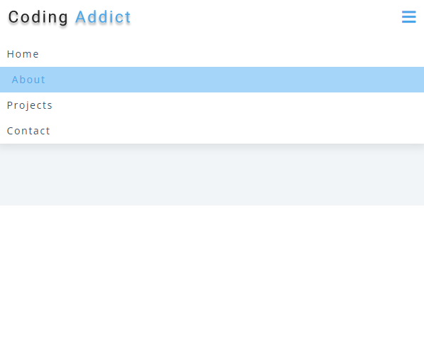
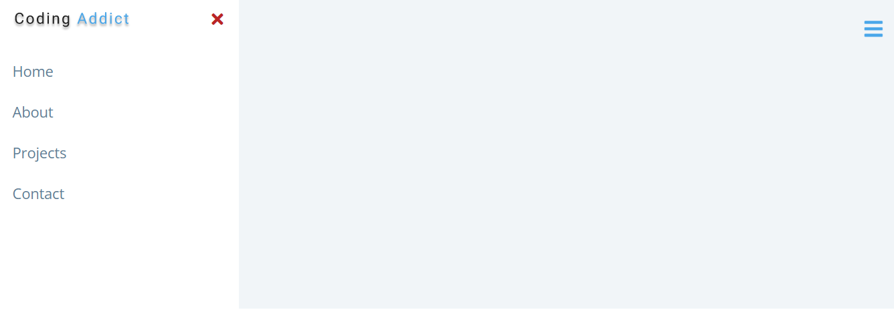
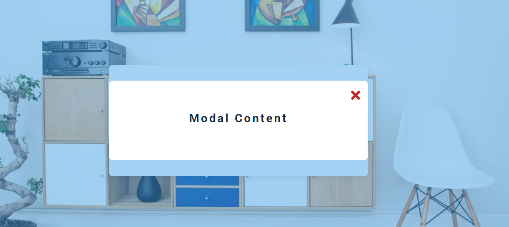
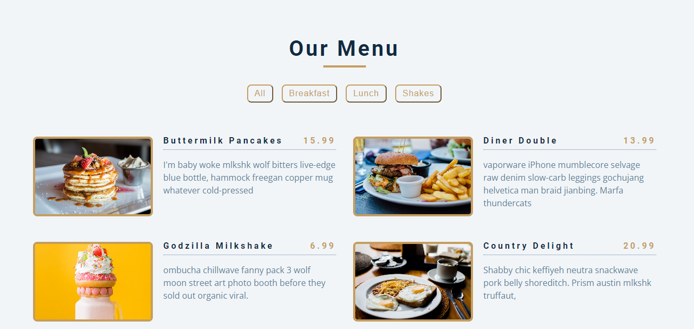

# Vanilla Javascript Projects 🤩🥳 

It is the repository where I host the projects I have created to improve my Javascript skills. (Without Frameworks)👾

| Table of Contents                          |
| ------------------------------------------ |
| [01-Color Flipper](#01-color-flipper)      |
| [02-Counter](#02-counter)                  |
| [03-Reviews](#03-reviews)                  |
| [04-Navbar](#04-navbar)                    |
| [05-Sidebar](#05-sidebar)                  |
| [06-Modal](#06-modal)                      |
| [07-Questions](#07-questions)              |
| [08-Menu](#08-menu)                        |
| [09-Video](#09-video)                      |

# 📌 Projects 📌 

## 01-Color-Flipper 🌈

Live URL💻: [https://erentasci.github.io/vanilla-javascript-projects/01-color-flipper/](https://erentasci.github.io/vanilla-javascript-projects/01-color-flipper/)

## 02-Counter 🔧

Live URL💻: [https://erentasci.github.io/vanilla-javascript-projects/02-counter/](https://erentasci.github.io/vanilla-javascript-projects/02-counter/)

## 03-Reviews 🔍

Live URL💻 : [https://erentasci.github.io/vanilla-javascript-projects/03-reviews/](https://erentasci.github.io/vanilla-javascript-projects/03-reviews/)

## 04-Navbar 📃

Live URL💻 : [https://erentasci.github.io/vanilla-javascript-projects/04-navbar/](https://erentasci.github.io/vanilla-javascript-projects/04-navbar/)

## 05-Sidebar 👆🏻

Live URL💻 : [https://erentasci.github.io/vanilla-javascript-projects/05-sidebar/](https://erentasci.github.io/vanilla-javascript-projects/05-sidebar/)

## 06-Modal 🗨

Live URL💻 : [https://erentasci.github.io/vanilla-javascript-projects/06-modal/](https://erentasci.github.io/vanilla-javascript-projects/06-modal/)

## 07-Questions ➕

Live URL💻 : [https://erentasci.github.io/vanilla-javascript-projects/07-questions/](https://erentasci.github.io/vanilla-javascript-projects/07-questions/)

## 08-Menu 📙

Live URL💻 : [https://erentasci.github.io/vanilla-javascript-projects/08-menu/](https://erentasci.github.io/vanilla-javascript-projects/08-menu/)

## 09-Video ⏯

Live URL💻 : [https://erentasci.github.io/vanilla-javascript-projects/09-video/](https://erentasci.github.io/vanilla-javascript-projects/09-video/)
